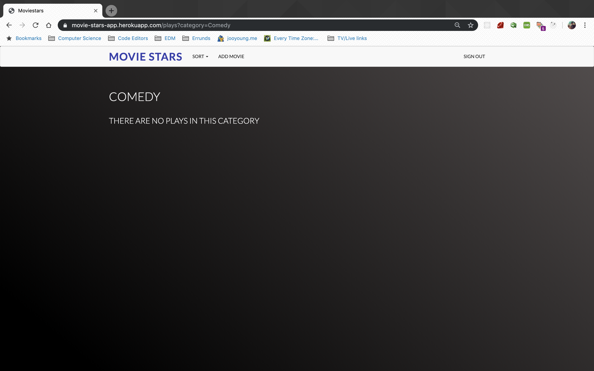
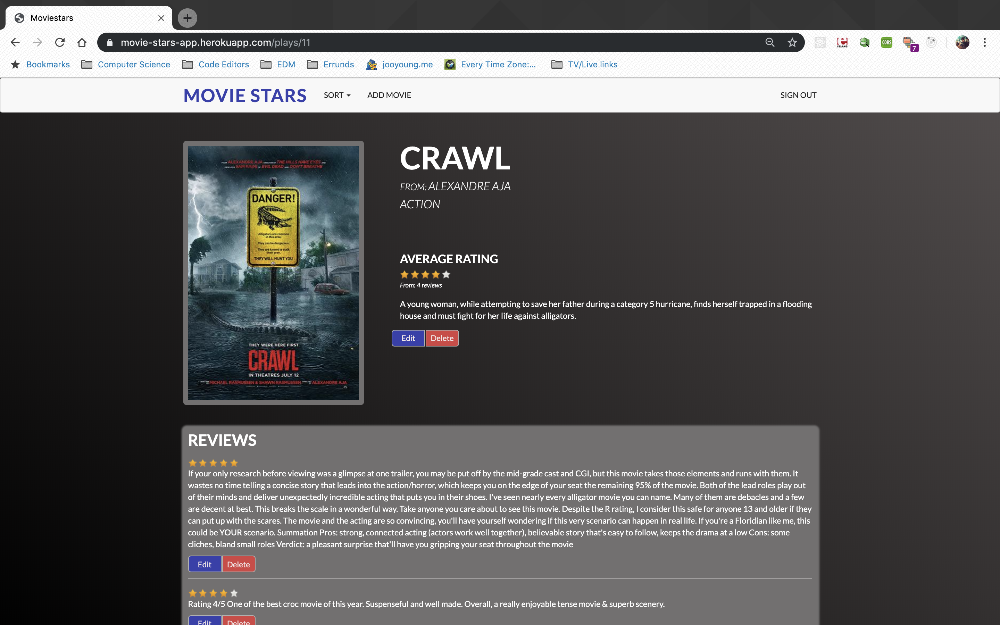
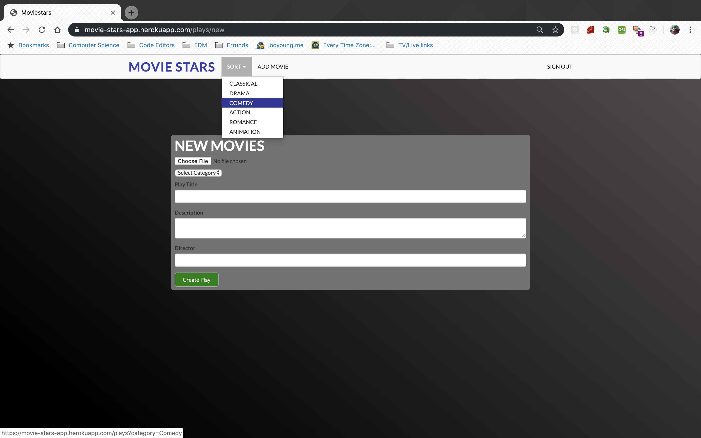
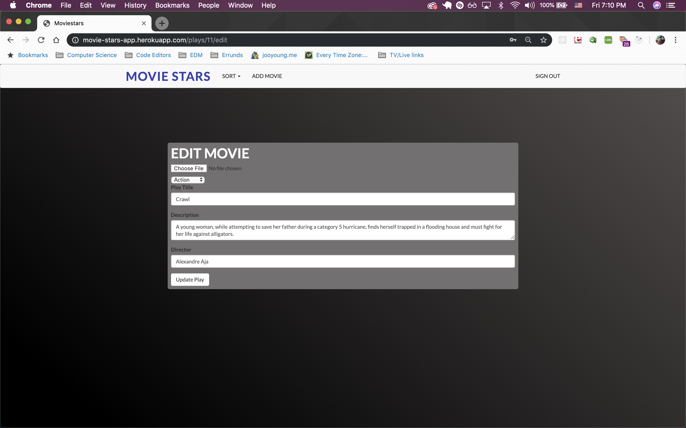
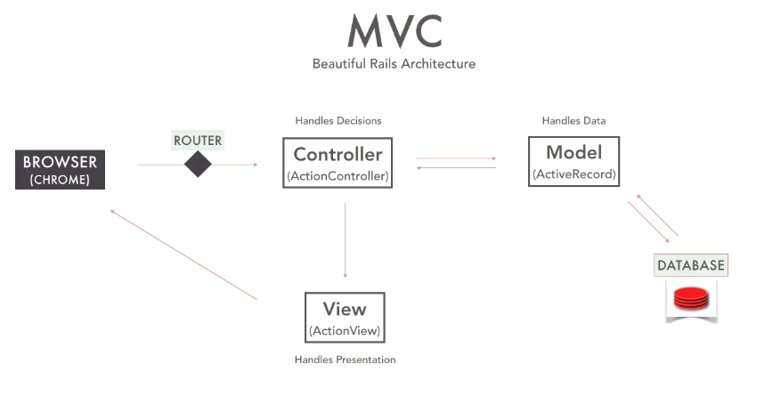
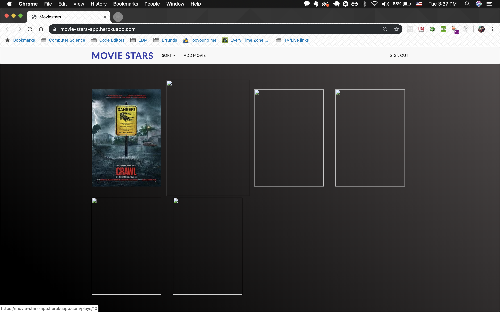

# Movie Stars

Link: https://movie-stars-app.herokuapp.com

## Challenge

Movie rating CRUD app for users to add and rate movies with fully user authentication functionalities

## Technologies

- Ruby on Rails
- PostgreSQL
- MVC Pattern
- Devise
- Sass / Bootsrap-Sass
- Paperclip
- Simple-form
- jQuery Rails
- AWS S3 Cloud
- Test Driven Development (TDD with rspec and capybara)

## Included Features

- User authentication is allowed by the devise gem.
- Users can create movie posts information including image of the movie, movie title, description and director.
- Users can rate on pre-posted movie posts with stars provided by raty.js.
- User can view all listed movies page, single movie page, create and edit page.

## Ruby on Rails setup

`$ rails new Moviestars --database=postgresql`

This command will generate all the boiler plate of ruby on rails application with postgresql database.

## CRUD Movies Algorithm







We can run to generate models by running:

`$ rails generate model Play title:string description:text director:string`

`$ rails generate model Review rating:integer comment:text`

`$ rails generate model Category name:string`

and we can generate migration files as following the relations by running:

`$ rails generate migration ...`

And then migration those migration files in to schema.rb by running

`$ rails db:migrate`

We can create controller by running:

`$ rails generate controller Movies`

The controller where we can control our model and view to create CRUD functionalities.

`Create: new, create Read: show, index Update: edit, update Delete: destroy`

These methods can be used to generate each CRUD functionalities.

And same for CRUD functionalities with reviews as well. You can find more details in the app/controllers repository.



## Models relations

Play belongs to user and category and has many reviews

```ruby
class Play < ApplicationRecord
	belongs_to :user
	belongs_to :category
	has_many :reviews
end
```

Review belongs to play and user

```ruby
class Review < ApplicationRecord
	belongs_to :play
	belongs_to :user
end
```

Category has many plays

```ruby
class Category < ApplicationRecord
	has_many :plays
end
```

## Authentication set up

As following the documentation from devise github:

we can run

`$ rails generate devise:install`

`$ rails generate devise User`

`$ rails db:migrate`

would add devise methods as below, and we can also add relations to plays and reviews.

```ruby
class User < ApplicationRecord
	has_many :plays
	has_many :reviews
	# Include default devise modules. Others available are:
	# :confirmable, :lockable, :timeoutable, :trackable and :omniauthable
	devise :database_authenticatable,
	       :registerable,
	       :recoverable,
	       :rememberable,
	       :validatable
end
```

And with devise gem setup, setting User model has many plays and reviews in User.rb file.

## Problems



Uploading images directly from public/images file to heroku didn't work. On heroku, each dyno gets its own ephemeral filesystem, with a fresh copy of the most recently deployed code. During the dyno’s lifetime its running processes can use the filesystem as a temporary scratchpad, but no files that are written are visible to processes in any other dyno and any files written will be discarded the moment the dyno is stopped or restarted. so I decided to use AWS S3 for the cloud storage where I can keep the image even though the dyno on heroku restarts.

## Test Driven Development:
