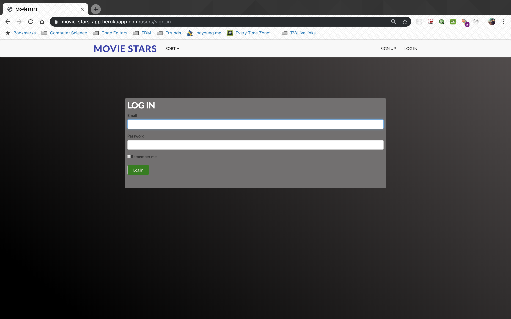
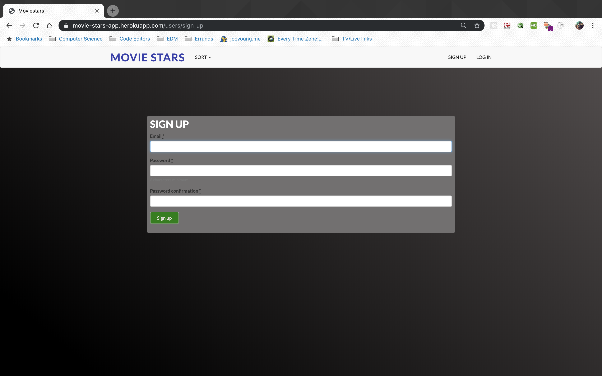

# Movie Stars

Link: https://movie-stars-app.herokuapp.com

## Challenge

Movie rating CRUD app for users to add and rate movies with fully user authentication functionalities

## Technologies

- Ruby on Rails
- PostgreSQL
- MVC Pattern
- Devise
- Sass / Bootsrap-Sass
- Paperclip
- Simple-form
- jQuery Rails
- AWS S3 Cloud
- Test Driven Development (TDD with rspec and capybara)

## Included Features

- User authentication is allowed by the devise gem.
- Users can create movie posts information including image of the movie, movie title, description and director.
- Users can rate on pre-posted movie posts with stars provided by raty.js.
- User can view all listed movies page, single movie page, create and edit page.

## Ruby on Rails setup

`rails new Moviestars --database=postgresql`

This command will generate all the boiler plate of ruby on rails application with postgresql database.

## CRUD Movies Algorithm

We can run to create Movie model by running:

`rails generate model Movie title:string description:text director:string`

and we can migrate migration file by running:

`rails db:migrate`

We can create controller by running:

`rails generate controller Movies`

The controller where we can control our model and view to create CRUD functionalities.

`Create: new, create Read: show, index Update: edit, update Delete: destroy`

These methods can be used to generate each CRUD functionalities.

And same for CRUD functionalities with ratings as well.

## User Stories:

New Gathering Page: As a user I want to be able to create a new gathering with specific information (title, description, date, time, latitude and longitude)

See All Page: As a user I want to be able to see all gatherings I posted

Edit Page: As a user I want to be able to update a information (title, description, date, time, latitude and longitude) to reflect my current needs

Delete Functionality: As a user I want to be able to delete a gathering plan if I no longer need it/if it is no longer available

I feel this project would be especially useful to people who want to save their gatherings/plans with specific location information showing on the google map.

But there are few more features I want to add. I want to add more features such as add an function that leads postings posts into calender component to see better and easy view of when the gatherings are on. For authentication functionality, I was trying to use the auth0 library but still working on it.

##Problems during the project

Uploading images directly from public/images file to heroku didn't work. On heroku, each dyno gets its own ephemeral filesystem, with a fresh copy of the most recently deployed code. During the dyno’s lifetime its running processes can use the filesystem as a temporary scratchpad, but no files that are written are visible to processes in any other dyno and any files written will be discarded the moment the dyno is stopped or restarted. so I decided to use S3 for the cloud storage where I can keep the image even though the dyno on heroku restarts.

## Wireframes:

